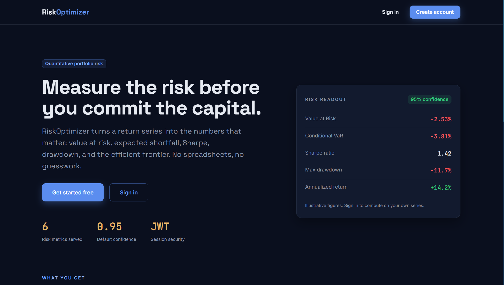

# RiskOptimizer


[](https://github.com/quantsingularity/RiskOptimizer/actions)
[](LICENSE)

## AI-Powered Portfolio Risk Management Platform

RiskOptimizer is an advanced portfolio risk management platform that leverages artificial intelligence and blockchain technology to help investors optimize their investment strategies and manage risk effectively.

<div align="center">
  
</div>

## Table of Contents

- [Overview](#overview)
- [Project Structure](#project-structure)
- [Key Features](#key-features)
- [Technology Stack](#technology-stack)
- [Architecture](#architecture)
- [Development Workflow](#development-workflow)
- [Installation and Setup](#installation-and-setup)
- [Testing](#testing)
- [CI/CD Pipeline](#cicd-pipeline)
- [Documentation](#documentation)
- [Contributing](#contributing)
- [License](#license)

## Overview

RiskOptimizer is a comprehensive platform designed to help investors make data-driven decisions by providing advanced risk analysis, portfolio optimization, and predictive analytics. The platform combines traditional financial models with cutting-edge AI and blockchain technology to deliver accurate, transparent, and secure investment insights.

## Project Structure

The project is organized into several main components:

```
RiskOptimizer/
├── code/                   # Core backend logic, services, and shared utilities
├── docs/                   # Project documentation
├── infrastructure/         # DevOps, deployment, and infra-related code
├── mobile-frontend/        # Mobile application
├── web-frontend/           # Web dashboard
├── scripts/                # Automation, setup, and utility scripts
├── LICENSE                 # License information
└── README.md               # Project overview and instructions
```

## Key Features

### Risk Analysis

| Feature                             | Description                                                                                |
| :---------------------------------- | :----------------------------------------------------------------------------------------- |
| **Value at Risk (VaR) Calculation** | Estimate potential losses using historical simulation, parametric, and Monte Carlo methods |
| **Stress Testing**                  | Simulate portfolio performance under extreme market conditions                             |
| **Correlation Analysis**            | Identify relationships between assets to optimize diversification                          |
| **Volatility Forecasting**          | Predict market volatility using GARCH models and machine learning                          |

### Portfolio Optimization

| Feature                                    | Description                                              |
| :----------------------------------------- | :------------------------------------------------------- |
| **Modern Portfolio Theory Implementation** | Optimize asset allocation based on risk-return profiles  |
| **Multi-objective Optimization**           | Balance risk, return, and other constraints              |
| **Rebalancing Recommendations**            | Receive suggestions for portfolio adjustments            |
| **Tax-efficient Strategies**               | Minimize tax impact while maintaining optimal allocation |

### AI-Powered Predictions

| Feature                          | Description                                                               |
| :------------------------------- | :------------------------------------------------------------------------ |
| **Market Trend Prediction**      | Forecast market movements using deep learning models                      |
| **Anomaly Detection**            | Identify unusual market patterns that may indicate opportunities or risks |
| **Sentiment Analysis**           | Analyze news and social media to gauge market sentiment                   |
| **Personalized Recommendations** | Receive tailored investment advice based on risk tolerance                |

### Blockchain Integration

| Feature                             | Description                                             |
| :---------------------------------- | :------------------------------------------------------ |
| **Transparent Transaction Records** | Immutable history of portfolio changes                  |
| **Smart Contract Automation**       | Automate investment rules and risk management protocols |
| **Decentralized Identity**          | Secure user authentication and data protection          |
| **Tokenized Assets**                | Support for digital asset investments and tracking      |

## Technology Stack

### Backend

| Component      | Technologies                                                               |
| :------------- | :------------------------------------------------------------------------- |
| **Languages**  | Python (core logic), JavaScript/JSX (frontend), Solidity (smart contracts) |
| **Frameworks** | Flask + Flasgger (REST API with Swagger docs)                              |
| **Database**   | PostgreSQL, MongoDB                                                        |
| **AI/ML**      | TensorFlow, PyTorch, scikit-learn                                          |
| **Blockchain** | Ethereum, Solidity, Web3.py                                                |

### Frontend

| Component              | Technologies                    |
| :--------------------- | :------------------------------ |
| **Framework**          | React with TypeScript           |
| **State Management**   | Redux                           |
| **Data Visualization** | D3.js, Recharts                 |
| **Styling**            | Tailwind CSS, Styled Components |
| **Web3**               | ethers.js, web3.js              |

### Infrastructure

| Component            | Technologies               |
| :------------------- | :------------------------- |
| **Containerization** | Docker                     |
| **Orchestration**    | Kubernetes                 |
| **CI/CD**            | GitHub Actions             |
| **Monitoring**       | Prometheus, Grafana        |
| **Cloud**            | AWS, Google Cloud Platform |

## Architecture

RiskOptimizer follows a microservices architecture with the following components:

```
RiskOptimizer/
├── Backend Services
│   ├── Risk Analysis Service
│   ├── Portfolio Optimization Service
│   ├── Market Data Service
│   ├── AI Prediction Service
│   └── Blockchain Integration Service
├── Frontend Applications
│   ├── Web Dashboard
│   └── Mobile App
├── Data Processing Pipeline
│   ├── Data Collection
│   ├── Feature Engineering
│   ├── Model Training
│   └── Inference Engine
└── Infrastructure
    ├── Database Cluster
    ├── Kubernetes Deployment
    ├── CI/CD Pipeline
    └── Monitoring Stack
```

## Development Workflow

### Core Algorithms

| Algorithm Type                     | Purpose                                        |
| :--------------------------------- | :--------------------------------------------- |
| **Neural Networks**                | Predictive modeling                            |
| **Markowitz Model**                | Portfolio allocation (Optimization algorithms) |
| **Time Series Forecasting Models** | Market prediction                              |
| **Natural Language Processing**    | Sentiment analysis                             |

### 1. Blockchain Integration

| Step                      | Description                                              |
| :------------------------ | :------------------------------------------------------- |
| **Smart Contracts**       | Develop for secure transaction tracking                  |
| **Blockchain Connection** | Connect to Ethereum or Solana using web3.js or ethers.js |
| **Identity**              | Implement decentralized identity and authentication      |

### 2. AI Model Development

| Step                    | Description                                                                      |
| :---------------------- | :------------------------------------------------------------------------------- |
| **Model Training**      | Train models on historical market data for predictive analytics and optimization |
| **Asset Performance**   | Use regression models to forecast asset performance                              |
| **Adaptive Strategies** | Implement reinforcement learning for adaptive portfolio strategies               |

### 3. Backend Development

| Step                | Description                                                               |
| :------------------ | :------------------------------------------------------------------------ |
| **API Building**    | Build APIs to fetch blockchain data and process AI-driven recommendations |
| **Data Handling**   | Securely handle user data and portfolio analytics                         |
| **Data Processing** | Implement real-time data processing pipelines                             |

### 4. Frontend Development

| Step                | Description                                                                  |
| :------------------ | :--------------------------------------------------------------------------- |
| **Dashboards**      | Create dashboards with React.js and integrate interactive charts using D3.js |
| **User Interfaces** | Develop intuitive user interfaces for complex financial data                 |
| **Responsiveness**  | Implement responsive design for cross-device compatibility                   |

## Installation and Setup

### 1. Clone the Repository

```bash
git clone https://github.com/quantsingularity/RiskOptimizer.git
cd RiskOptimizer

# Run the setup script to configure the environment
./setup_environment.sh
```

### 3. Install Backend Dependencies

```bash
cd code/backend
pip install -r requirements.txt
```

### 4. Install Frontend Dependencies

```bash
cd code/frontend
npm install
```

### 5. Deploy Smart Contracts

```bash
cd code/blockchain
npx hardhat compile
npx hardhat deploy --network <network_name>
```

### 6. Start the Application

```bash
# Start the entire application using the convenience script
./run_riskoptimizer.sh

# Or start components individually
# Start Backend
cd code/backend
python app.py

# Start Frontend
cd code/frontend
npm start
```

## Model Performance

RiskOptimizer's quantitative and ML models are validated against held-out historical data.
Full tearsheets are in **[docs/ML_MODEL_PERFORMANCE.md](docs/ML_MODEL_PERFORMANCE.md)**.

| Model / Method                 | Key Metric           | Value   |
| ------------------------------ | -------------------- | ------- |
| GBM VaR (95 %)                 | Kupiec p-value       | 0.68 ✅ |
| Hybrid VaR (GBM + Historical)  | Coverage             | 95.1 %  |
| EVT (POT) — TSLA 99 % VaR      | EVT VaR              | 9.87 %  |
| Max-Sharpe Portfolio           | Out-of-sample Sharpe | 1.15    |
| Parallel Monte Carlo (8 cores) | Speedup              | 5.9×    |
| Prophet Forecast (AAPL)        | MAPE                 | 3.81 %  |

## Testing

The project maintains comprehensive test coverage across all components to ensure reliability and accuracy.

### Test Coverage

| Component              | Coverage | Status |
| :--------------------- | :------- | :----- |
| Risk Analysis Service  | 92%      | ✅     |
| Portfolio Optimization | 88%      | ✅     |
| Market Data Service    | 85%      | ✅     |
| AI Prediction Models   | 80%      | ✅     |
| Blockchain Integration | 82%      | ✅     |
| Frontend Components    | 83%      | ✅     |
| Overall                | 85%      | ✅     |

### Unit Tests

| Test Type               | Description                               |
| :---------------------- | :---------------------------------------- |
| **Backend API**         | Endpoint tests using pytest               |
| **Frontend Components** | Tests with Jest and React Testing Library |
| **Smart Contracts**     | Tests with Truffle/Hardhat                |
| **AI Models**           | Model validation tests                    |

### Integration Tests

| Test Type         | Description                       |
| :---------------- | :-------------------------------- |
| **End-to-End**    | Tests for complete user workflows |
| **API**           | API integration tests             |
| **Blockchain**    | Blockchain interaction tests      |
| **Data Pipeline** | Data pipeline validation          |

### Performance Tests

| Test Type                 | Description                                   |
| :------------------------ | :-------------------------------------------- |
| **Load Testing**          | Load testing for API endpoints                |
| **Optimization**          | Optimization algorithm performance benchmarks |
| **Real-time Data**        | Real-time data processing tests               |
| **Blockchain Throughput** | Blockchain transaction throughput tests       |

To run tests:

```bash
# Backend tests
cd code/backend
pytest

# Frontend tests
cd code/frontend
npm test

# Smart contract tests
cd code/blockchain
npx hardhat test

# AI model tests
cd code/ai_models
python -m unittest discover

# Run all tests
python validate_project.py --run-tests
```

## CI/CD Pipeline

RiskOptimizer uses GitHub Actions for continuous integration and deployment:

| Stage                | Control Area                    | Institutional-Grade Detail                                                              |
| :------------------- | :------------------------------ | :-------------------------------------------------------------------------------------- |
| **Formatting Check** | Change Triggers                 | Enforced on all `push` and `pull_request` events to `main` and `develop`                |
|                      | Manual Oversight                | On-demand execution via controlled `workflow_dispatch`                                  |
|                      | Source Integrity                | Full repository checkout with complete Git history for auditability                     |
|                      | Python Runtime Standardization  | Python 3.10 with deterministic dependency caching                                       |
|                      | Backend Code Hygiene            | `autoflake` to detect unused imports/variables using non-mutating diff-based validation |
|                      | Backend Style Compliance        | `black --check` to enforce institutional formatting standards                           |
|                      | Non-Intrusive Validation        | Temporary workspace comparison to prevent unauthorized source modification              |
|                      | Node.js Runtime Control         | Node.js 18 with locked dependency installation via `npm ci`                             |
|                      | Web Frontend Formatting Control | Prettier checks for web-facing assets                                                   |
|                      | Mobile Frontend Formatting      | Prettier enforcement for mobile application codebases                                   |
|                      | Documentation Governance        | Repository-wide Markdown formatting enforcement                                         |
|                      | Infrastructure Configuration    | Prettier validation for YAML/YML infrastructure definitions                             |
|                      | Compliance Gate                 | Any formatting deviation fails the pipeline and blocks merge                            |

## Documentation

| Document                    | Path                 | Description                                                    |
| :-------------------------- | :------------------- | :------------------------------------------------------------- |
| **README**                  | `README.md`          | High-level overview, project scope, and repository entry point |
| **Installation Guide**      | `INSTALLATION.md`    | Step-by-step installation and environment setup                |
| **API Reference**           | `API.md`             | Detailed documentation for all API endpoints                   |
| **CLI Reference**           | `CLI.md`             | Command-line interface usage, commands, and examples           |
| **User Guide**              | `USAGE.md`           | Comprehensive end-user guide, workflows, and examples          |
| **Architecture Overview**   | `ARCHITECTURE.md`    | System architecture, components, and design rationale          |
| **Configuration Guide**     | `CONFIGURATION.md`   | Configuration options, environment variables, and tuning       |
| **Feature Matrix**          | `FEATURE_MATRIX.md`  | Feature coverage, capabilities, and roadmap alignment          |
| **Contributing Guidelines** | `CONTRIBUTING.md`    | Contribution workflow, coding standards, and PR requirements   |
| **Troubleshooting**         | `TROUBLESHOOTING.md` | Common issues, diagnostics, and remediation steps              |

## Contributing

| Step             | Command/Action                                                         |
| :--------------- | :--------------------------------------------------------------------- |
| **Fork**         | Fork the repository                                                    |
| **Branch**       | Create your feature branch (`git checkout -b feature/amazing-feature`) |
| **Commit**       | Commit your changes (`git commit -m 'Add some amazing feature'`)       |
| **Push**         | Push to the branch (`git push origin feature/amazing-feature`)         |
| **Pull Request** | Open a Pull Request                                                    |

## License

This project is licensed under the MIT License - see the [LICENSE](LICENSE) file for details.
